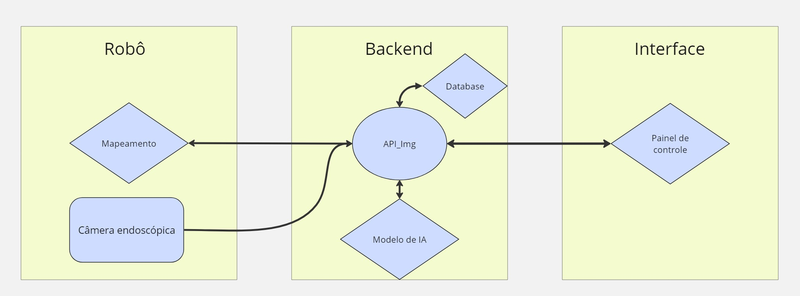

## Introdução 

A arquitetura de um sistema é uma parte primordial para compreender como as diferentes partes se conectam e como a integração dessas partes foi pensada.

Nesta primeira iteração, foi concebida uma arquitetura simples. O objetivo inicial é permitir que o robô mapeie o reboiler para se localizar e identificar os tubos individuais. Posteriormente, o robô se desloca para cada tubo, inserindo uma câmera de endoscopia dentro do cano para realizar a análise dos dados. Isso permite que o modelo de inteligência artificial determine se o tubo está limpo ou não.

## Arquitetura 

Pensando em uma arquitetura modularizada capaz de atender às demandas especificadas anteriormente, foi desenvolvido o esquemático abaixo para representar essa primeira iteração. 

**Legenda**: Um aspecto importante ao observar a arquitetura é que cada quadrado representa um bloco individual do sistema. Além disso, as figuras em formato de losango representam partes do software, enquanto os retângulos representam peças de hardware. 

Nos parágrafos a seguir, serão destacados a função de cada um desses módulos e a integração dos mesmos.

#### Mapeamento 

O módulo de mapeamento é responsável por mapear o reboiler e identificar cada buraco individual. O objetivo é haver um controle e um método que permita com que o robô saiba onde está no espaço e garantir que todos os 2000 tubos sejam verificados. 

#### Periféricos 

Os periféricos se tratam do sistema de câmeras que irão gravar dentro de cada tubo individual. 
A partir do momento que há a geração constante de dados os mesmos são enviados para a *API_Img*

#### API_Img 

A api de imagem tem o objetivo de receber as imagens dos periféricos e realizar o tratamento das mesmas. A partir disso, as fotos são utilizadas como input para o modelo de IA. 

#### Modelo de IA 

O modelo de IA tem como seu principal objetivo verificar se um tubo esta limpo ou não. Com base nessa informação os dados são enviados para o frontend. 

#### Painel de Controle 

O painel de controle é responsável por permitir uma visualização geral dos tubos do reboiler e caso exista tubos sujos há um aviso indicando o estado atual de cada tubo. 

## Conclusão 

Nesta primeira sprint, o principal objetivo foi compreender o projeto e conceber um método para atender às demandas da Atvos. As próximas versões da arquitetura conterão mais atualizações e mudanças, as quais serão implementadas à medida que os membros do grupo consolidarem seus aprendizados.