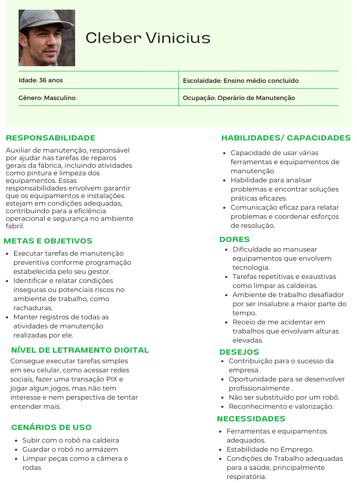
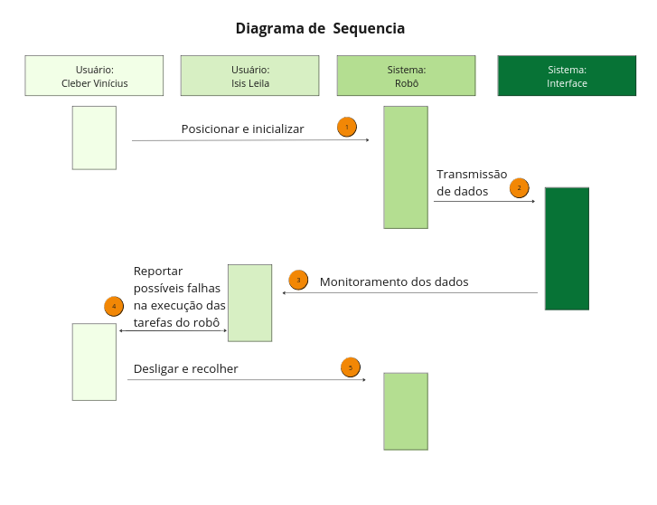

# Proposta de Design

&emsp;Nesta seção, conduzimos o estudo de UX do projeto, buscando compreender o perfil dos possíveis usuários da solução proposta, assim como o processo envolvido, para definir as etapas, interações e necessidades que o projeto deve abordar de maneira eficaz. Para isso, desenvolvemos os seguintes elementos:

- Personas
- User Stories
- Arquitetura da Informação

&emsp;A seguir, é apresentada a documentação de cada elemento.

## Personas

&emsp;A persona, um retrato fictício do cliente ideal de um negócio, é elaborada com base em informações e características reais do público-alvo. Essa ferramenta constroi representações fictícias de clientes ideais, baseadas em dados reais e pesquisas com o público-alvo. Elas ajudam a entender melhor as necessidades, dores, objetivos e comportamentos dos usuários finais.

&emsp;Desenvolver personas pode ajudar uma equipe a formular um IoT para a empresa Ativos. Isso porque, ao criar personas, a equipe pode se colocar no lugar dos usuários e criar soluções mais adequadas e personalizadas para eles. Como parte deste projeto, foram desenvolvidas representações visuais ilustrativas de três personas principais identificadas abaixo:

<b> Figura persona 1 - Persona:</b> Ísis Leila 

  
  
<b>Fonte:</b> Elaborado por Cannabot

<b> Figura persona 1 - Persona:</b> Cleber Vínicius 

  
  
<b>Fonte:</b> Elaborado por Cannabot

&emsp;Em resumo, a criação de personas é mais do que uma simples representação gráfica de usuários; é um processo dinâmico e estratégico que amplia a compreensão das necessidades, expectativas e desafios que nossos clientes enfrentam. Ao desenvolver personas significativas, não apenas moldamos produtos e serviços mais alinhados com as demandas reais, mas também cultivamos uma conexão mais profunda e empática com nosso público.

&emsp;Portanto, a construção de personas transcende a esfera do design e se estende a toda a estratégia empresarial, orientando-nos na busca constante pela satisfação do cliente e pela inovação centrada nas pessoas. Dessa maneira, destaca-se o público raiz que vai utilizar a solução: profissionais fabris e equipes de gestão. Com isso em mente, a equipe CannaBot pode guiar o desenvolvimento com objetivos claros e palpáveis.

## User Stories
&emsp;As User Stories consistem em uma técnica importante para entender não apenas o sistema em si, mas principalmente como os usuários interagem com ele. Elas são mais do que simples frases; são narrativas que encapsulam o ponto de vista e as necessidades específicas de um usuário em relação à solução proposta. Cada user story deve conter três elementos essenciais:

&emsp;*- Quem:* Este elemento identifica o usuário envolvido na interação com o sistema. Representa um ponto de vista único e um contexto específico dentro da solução.

&emsp;*-O que:* Aqui, descreve-se a ação que o usuário realizará no sistema. Essa ação define a natureza da interação e as necessidades básicas que o sistema deve atender. 

&emsp;*-Para que:* Este elemento delineia o objetivo final que o usuário pretende alcançar ao realizar a ação descrita. É a motivação por trás das interações e evidencia o papel tanto do usuário quanto da tecnologia no contexto geral. Esclarece por que a ação é relevante e como ela se encaixa no fluxo de trabalho ou na jornada do usuário.

&emsp;Esses elementos combinados fornecem uma visão geral das necessidades dos usuários e orientam o desenvolvimento do sistema de forma a atender às suas expectativas e objetivos. A partir dessa contextualização, é possível elencar as prioridades do projeto e desenvolver uma solução mais próxima 
<!--  -->

## Arquitetura da informação

### Diagrama de Contexto

### Diagrama de Sequência

&emsp;Um diagrama de sequência (UX) desempenha um papel crucial na concepção e no desenvolvimento de projetos, fornecendo uma representação visual das interações entre os usuários e o sistema. Ao oferecer uma visão detalhada das etapas que os usuários percorrem durante suas interações, desde a inicialização do sistema até a conclusão de tarefas específicas, o diagrama de sequência UX permite aos designers compreenderem melhor as necessidades e expectativas dos usuários. Essa compreensão profunda é essencial para criar uma experiência do usuário fluida e intuitiva, além de identificar oportunidades de otimização e aprimoramento da interface. Assim, o diagrama de sequência UX serve como um guia valioso durante todo o processo de design, desde a concepção inicial até a implementação final, garantindo que o produto final atenda às necessidades e expectativas dos usuários de forma eficaz.

<b> Figura persona 1 - Persona:</b> Cleber Vínicius 

  
  
<b>Fonte:</b> Elaborado por Cannabot

&emsp;Ao observar nosso diagrama é possível visualizar marcações com números em suas interações, iremos detalhar melhor essas interações abaixo de forma textual:

&emsp;1- O operário de manutenção sobe com o robô no reboiler e posiciona ele no centro para que seja inicializado.

&emsp;2- O robô inicia a operação e transmissão de dados para a interface da solução.

&emsp;3- O operador de sistemas começa a monitorar os dados que estão chegando na interface.

&emsp;4- Tanto o operário de manutenção quanto o operador de sistemas observa possíveis ajustes necessários a serem feitos no robô e apontam no relatório final da operação, como reparosna carenagem e problemas no software.

&emsp;5- O operário de manutenção desliga e recolhe o robô para que seja levado até o armázem.

&emsp;Em suma, o diagrama de sequência UX é uma ferramenta indispensável para o desenvolvimento de projetos orientados ao usuário. Ao oferecer uma representação visual clara das interações entre os usuários e o sistema, ele permite aos designers compreenderem profundamente as necessidades e expectativas dos usuários, orientando o processo de design para criar uma experiência do usuário excepcional. Desde a concepção até a implementação, o diagrama de sequência UX serve como um guia valioso, garantindo que o produto final seja intuitivo, eficaz e capaz de proporcionar uma experiência de usuário satisfatória.