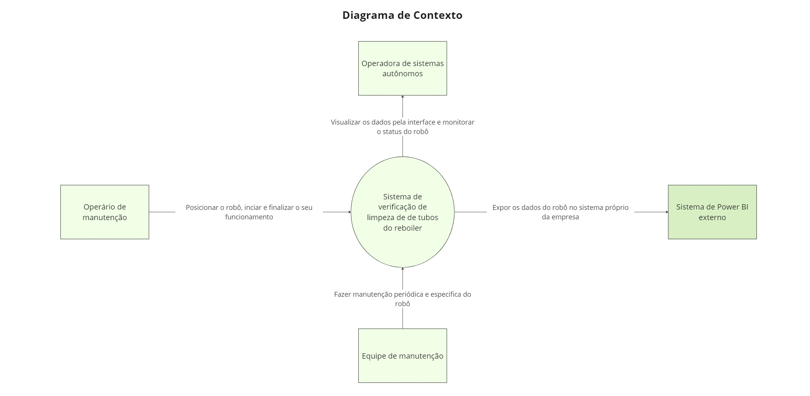

# Arquitetura da informação

## Diagrama de Contexto

### Diagrama de Sequência

&emsp;Um diagrama de sequência (UX) desempenha um papel crucial na concepção e no desenvolvimento de projetos, fornecendo uma representação visual das interações entre os usuários e o sistema. Ao oferecer uma visão detalhada das etapas que os usuários percorrem durante suas interações, desde a inicialização do sistema até a conclusão de tarefas específicas, o diagrama de sequência UX permite aos designers compreenderem melhor as necessidades e expectativas dos usuários. Essa compreensão profunda é essencial para criar uma experiência do usuário fluida e intuitiva, além de identificar oportunidades de otimização e aprimoramento da interface. Assim, o diagrama de sequência UX serve como um guia valioso durante todo o processo de design, desde a concepção inicial até a implementação final, garantindo que o produto final atenda às necessidades e expectativas dos usuários de forma eficaz.

<b> Figura persona 1 - Persona:</b> Cleber Vínicius 

  
  
<b>Fonte:</b> Elaborado por Cannabot

&emsp;Ao observar nosso diagrama é possível visualizar marcações com números em suas interações, iremos detalhar melhor essas interações abaixo de forma textual:

&emsp;1- O operário de manutenção sobe com o robô no reboiler e posiciona ele no centro para que seja inicializado.

&emsp;2- O robô inicia a operação e transmissão de dados para a interface da solução.

&emsp;3- O operador de sistemas começa a monitorar os dados que estão chegando na interface.

&emsp;4- Tanto o operário de manutenção quanto o operador de sistemas observa possíveis ajustes necessários a serem feitos no robô e apontam no relatório final da operação, como reparosna carenagem e problemas no software.

&emsp;5- O operário de manutenção desliga e recolhe o robô para que seja levado até o armázem.

&emsp;Em suma, o diagrama de sequência UX é uma ferramenta indispensável para o desenvolvimento de projetos orientados ao usuário. Ao oferecer uma representação visual clara das interações entre os usuários e o sistema, ele permite aos designers compreenderem profundamente as necessidades e expectativas dos usuários, orientando o processo de design para criar uma experiência do usuário excepcional. Desde a concepção até a implementação, o diagrama de sequência UX serve como um guia valioso, garantindo que o produto final seja intuitivo, eficaz e capaz de proporcionar uma experiência de usuário satisfatória.