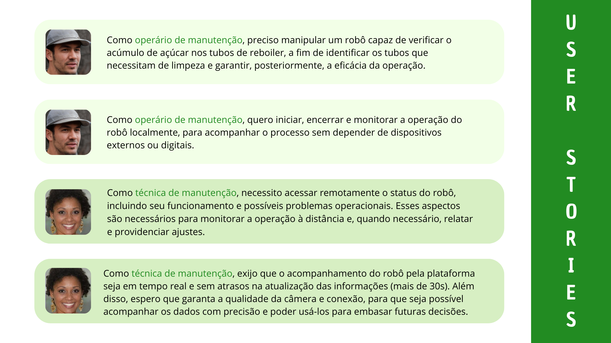

# User Stories

As User Stories consistem em uma técnica importante para entender não apenas o sistema em si, mas principalmente como os usuários interagem com ele. Elas são mais do que simples frases; são narrativas que encapsulam o ponto de vista e as necessidades específicas de um usuário em relação à solução proposta. Cada user story deve conter três elementos essenciais:

*Quem:* Este elemento identifica o usuário envolvido na interação com o sistema. Representa um ponto de vista único e um contexto específico dentro da solução.

*-O que:* Aqui, descreve-se a ação que o usuário realizará no sistema. Essa ação define a natureza da interação e as necessidades básicas que o sistema deve atender. 

*-Para que:* Este elemento delineia o objetivo final que o usuário pretende alcançar ao realizar a ação descrita. É a motivação por trás das interações e evidencia o papel tanto do usuário quanto da tecnologia no contexto geral. Esclarece por que a ação é relevante e como ela se encaixa no fluxo de trabalho ou na jornada do usuário.

Esses elementos combinados fornecem uma visão geral das necessidades dos usuários e orientam o desenvolvimento do sistema de forma a atender às suas expectativas e objetivos. A partir dessa contextualização, é possível elencar as prioridades do projeto e desenvolver uma solução mais próxima 
