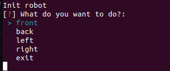
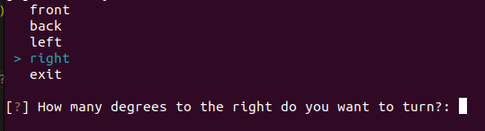
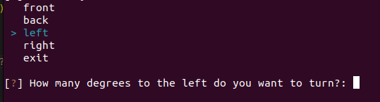
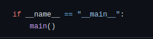
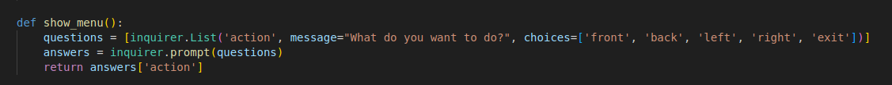
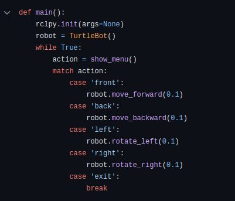

# CLI: Command-Line Interface
### O que é 'CLI' afinal?

&emsp;A CLI, ou Interface de Linha de Comando, é uma área de interação simplificada que permite aos usuários interagirem com um software através de comandos de texto. Geralmente integrada no início do desenvolvimento de um projeto, ela é crucial para testar e validar funcionalidades de maneira simplificada. Sua importância se torna evidente à medida que o projeto evolui e se integra a uma aplicação frontend no futuro.

&emsp;A construção da CLI para o projeto do grupo Cannabot foi concebida com foco na simplicidade e intuitividade para os usuários que irão testar a aplicação nesta fase inicial. Consideramos que, sendo um passo preliminar antes da integração com a aplicação frontend, não era necessário investir esforços excessivos em sua construção. Abaixo, apresentamos a primeira versão da interface de linha de comando do grupo Cannabot e detalhamos o processo de sua construção a partir de seu próprio código:

### Interface

&emsp;Ao executar nosso pacote ROS, uma interface gráfica será exibida no terminal, permitindo a interação com a solução. As opções disponíveis são as seguintes:

Figura Command-Line Interface 1:

  
  
<b>Fonte:</b> Elaborado por Cannabot

&emsp;Ao selecionar a opção 'right', será exibida uma segunda pergunta para inserir o comando, que consiste na quantidade de graus que o usuário deseja que o robô vire para a direita:

Figura Command-Line Interface 2:

  
  
<b>Fonte:</b> Elaborado por Cannabot

&emsp;Ao selecionar a opção 'left', também será exibida uma segunda pergunta para inserir o comando, que consiste na quantidade de graus que o usuário deseja que o robô vire para a esquerda:

Figura Command-Line Interface 3:

  
  
<b>Fonte:</b> Elaborado por Cannabot

### Código

&emsp;Ao executar nosso pacote com o comando ros2 run cannabot cannabot no terminal, na verdade estamos chamando o arquivo cannabot.py e executando sua função principal main() a partir do seguinte trecho de código:

Figura Command-Line Interface code 4:

  
  
<b>Fonte:</b> Elaborado por Cannabot

&emsp;Ao executar a função principal, ela inicia o seu propósito, que é emular a nossa CLI e apresentar as opções possíveis para a movimentação do robô:

Figura Command-Line Interface code 5:

  
  
<b>Fonte:</b> Elaborado por Cannabot

&emsp;Quando o usuário interage com nossa CLI e escolhe um comando para executar, a parte do código que interage com a classe do robô é acionada, resultando na movimentação correspondente. Por exemplo, se o usuário escolher "front", a classe do robô será chamada e ele executará a movimentação:

Figura Command-Line Interface code 6:

  
  
<b>Fonte:</b> Elaborado por Cannabot

### Conclusão

&emsp;A CLI desempenha um papel fundamental no processo de desenvolvimento do projeto Cannabot, oferecendo uma maneira simples e direta para os usuários interagirem com a solução. Através dela, é possível testar e validar as funcionalidades do robô de forma eficiente, contribuindo para a evolução do projeto. Embora seja uma etapa preliminar antes da integração com a aplicação frontend, a CLI foi projetada com atenção aos detalhes, garantindo uma experiência intuitiva para os usuários. À medida que o projeto avança, a CLI continuará a ser aprimorada e integrada às demais partes da aplicação, impulsionando o desenvolvimento do Cannabot como um todo.

