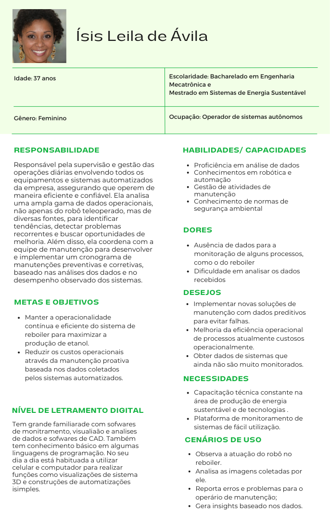

# CLI: Command-Line Interface
### O que é 'CLI' afinal?

&emsp;CLI ou command-line interface é uma área de interação simplificada. Usalamente ela é integrada a aplicação no ínicio do projeto para conseguir interagir com a solução e realizar testes de movimentação simplificadas. Isso revela sua importância em ser desenvolvida para escalar o projeto ao decorrer de seu desenvolvimento e integração com uma aplicação frontend no futuro.

&emsp;A construção da CLI do grupo Cannabot foi projetada para que seja o mais simples e intuitivo possivel para o usuario que irá testar a aplicação nesse ponto do projeto, pensamos tambem que como a CLI é um passo anterior para a aplicação frontend não seria de grande valia aplicar um esforço muito grande em sua construção. Veja abaixo a primeira versão da command-line interface do grupo cannabot e como foi seu processo de construçaão a partir do seu própio código:

Figura Command-Line Interface 1:

  
  
<b>Fonte:</b> Elaborado por Cannabot

