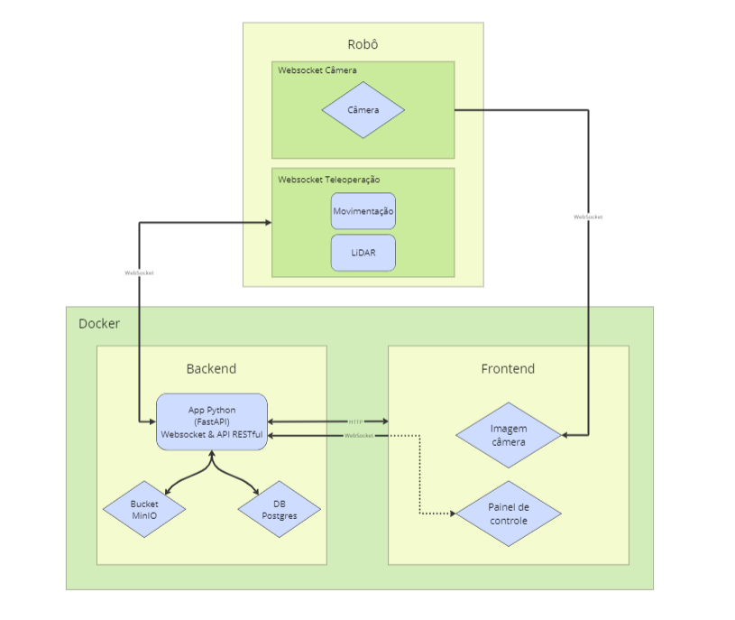

## Introdução

&emsp;A arquitetura de um sistema refere-se à estrutura geral e à organização dos componentes que o compõem, assim como às interações e dependências entre esses componentes. Ela abrange a definição de elementos como hardware, software, interfaces, e protocolos de comunicação, garantindo que todos esses elementos funcionem de maneira integrada e eficiente para atender aos requisitos do sistema. A arquitetura serve como um guia para o desenvolvimento, manutenção e evolução do sistema, proporcionando uma visão clara de suas funcionalidades e comportamentos esperados. Nessa seção, será detalhado a arquitetura final do sistema.

## Arquitetura do sistema

&emsp; A arquitetura do sistema foi dividida em quartro partes principais, sendo elas: o robô, backend, frontend e docker. A seguir, será detalhado cada uma dessas partes.

<b> Figura da arquitetura da solução</b>

  
  
<b>Fonte:</b> Elaborado por Cannabot

### Robô

&emsp;O robô é Turtlebot 3, que possui uma Raspberry Pi 4, que é responsável por controlar o robô e processar as imagens capturadas pela câmera. No robô, roda dois websockets, um deles é responsável por enviar as imagens capturadas pela câmera para o frontend e o outro é responsável por receber os comandos de movimentação e enviar os dados do LiDAR para o backend. 

### Backend

&emsp;O nosso backend é feito em Pythom, utilizando o framework FastAPI. O backend está constituído por tanto por um websocket quanto por uma API REST. O websocket é responsável por receber os dados do robô, do LiDAR, enviar os comandos de movimentação para o robô e enviar e receber os comandos do frontend. Já a API REST é responsável por armazenar dados no banco de dados e fornecer esses dados para o frontend. 

A&emsp;lém disso, temos nosso banco em PostgreSQL, que é responsável por armazenar os dados do usuário, dados do robô e log de execução. Também temos um bucket MinIO que é responsável por armazenar as imagens capturadas pelo robô.

### Frontend

&emsp;O frontend é feito em React, junto com Vite. O frontend é responsável por enviar os comandos de movimentação para o robô, exibir avisos de obstáculos, exibir as imagens capturadas pelo robô e exibir os dados do banco de dados. As imagens capturadas pelo robô são exibidas em tempo real, através do websocket que recebe as imagens diretamente do robô.

### Docker

&emsp;O docker é responsável por rodar o backend, frontend, banco de dados e MinIO. O docker-compose é responsável por orquestrar os containers, permitindo que o projeto seja facilmente executado em qualquer máquina que tenha o docker instalado.

## Considerações finais

&emsp;A arquitetura do sistema descrita integra de maneira eficiente e coordenada todos os componentes essenciais, proporcionando uma base robusta para o desenvolvimento, manutenção e evolução do projeto. Com a separação clara entre as funcionalidades do robô, backend, frontend e a utilização de Docker para orquestração, garantimos que cada parte do sistema possa ser desenvolvida e gerenciada de forma independente, mas ainda assim funcionando harmoniosamente como um todo.

&emsp;Ao adotar tecnologias como FastAPI para o backend, React para o frontend e Docker para a conteinerização, asseguramos não apenas a escalabilidade e a flexibilidade do sistema, mas também uma facilidade de implementação e replicação do ambiente de desenvolvimento. A decisão de manter as funcionalidades relacionadas ao ROS confinadas ao robô permitiu maior compatibilidade com diferentes sistemas operacionais, ampliando a acessibilidade do projeto.

&emsp;Essa abordagem modular e bem estruturada permite que futuros aprimoramentos e expansões sejam realizados de maneira ordenada e eficiente, garantindo que o sistema permaneça alinhado com os requisitos e expectativas dos usuários. Assim, a arquitetura apresentada não só atende às necessidades atuais, mas também está preparada para suportar o crescimento e a evolução contínua do projeto.