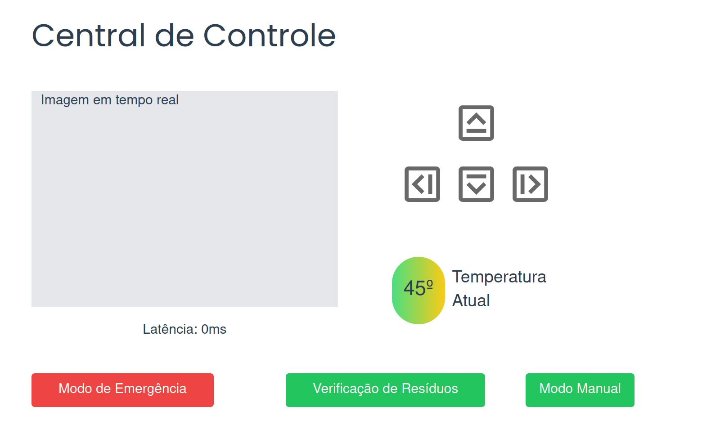

Este documento descreve o Sistema de Segurança desenvolvido para o projeto Cannabot, com o objetivo de garantir operações seguras do robô e a proteção dos operadores envolvidos. As principais medidas implementadas incluem um botão de parada de emergência e um sistema de detecção de obstáculos com parada automática do robô, visando proporcionar maior controle operacional e prevenir acidentes. A seguir, apresentamos uma análise detalhada do funcionamento de cada uma dessas medidas de segurança.

## Botão de Parada de Emergência

Durante a Sprint 2, a equipe Cannabot apresentou a primeira versão da funcionalidade de parada de emergência do robô, inicialmente implementada através da interface de linha de comando (CLI). Na Sprint 3, com a introdução da interface de usuário mostrada a seguir, foram realizadas alterações significativas na forma de ativação dessa função.

<b> Figura da Central de Controle</b>

  
  
<b>Fonte:</b> Elaborado por Cannabot

No projeto final (sprint 5), mantivemos a ativação da parada de emergência por meio da interface gráfica, conforme a imagem acima. Ao clicar no botão "Modo de Emergência" na tela "Central de Controle" do frontend, o usuário aciona o serviço de emergência. Este serviço Ros, ao ser requisitado, executa a função de parada do robô, fechando a conexão. Dessa forma, mesmo que haja tentativas de movimentar o robô através dos comandos do frontend, ele permanecerá imóvel. A única forma de restabelecer o funcionamento normal é reiniciando o robô manualmente.

## Detecção de Obstáculo e Parada Imediata

Uma abordagem crucial para garantir a segurança do sistema foi implementada através da detecção de obstáculos à frente ou atrás do robô. Essa funcionalidade desempenha um papel fundamental na prevenção de colisões e na garantia da integridade do equipamento e do ambiente ao seu redor.

A detecção de obstáculos permite que o robô reaja de forma proativa, impedindo qualquer movimento em direção a esses obstáculos, mesmo que o usuário tente comandar essa ação. Essa capacidade é especialmente vital em ambientes dinâmicos e imprevisíveis.

Para incorporar essa funcionalidade, utilizamos o Lidar. O LIDAR (Light Detection and Ranging) é um sensor que mede distâncias e detecta objetos ao redor do robô. Esse sensor emite um feixe de laser que varre o ambiente, calculando o tempo que leva para o feixe refletir de volta ao sensor após atingir um objeto. No modelo do Turtlebot3, o robô utilizado nesta prova de conceito, o Lidar já está integrado.

Com base nos dados fornecidos pelo Lidar, foi possível implementar uma lógica que impede a colisão do robô. Nessa lógica, é criada uma lista contendo todos os registros do lidar em uma varredura de 360 graus. Como essa lista é dinâmica, foi criada uma variável que armazena o tamanho dessa lista. A partir dessa informação, implementamos a lógica para determinar se há obstáculos à frente ou atrás do robô.

A lógica empregada consiste em dividir a lista em quatro partes para definir os quadrantes que compõem a circunferência do lidar. As variáveis A e B representam, respectivamente, as delimitações do primeiro e do último quadrante, partindo do ângulo 0. Para detectar se um obstáculo está atrás do robô, verificamos se seu índice na lista é maior que A e menor que B, ou seja, se ele está no segundo ou terceiro quadrante. Caso contrário, o obstáculo está à frente do robô.

Consideramos uma distância de 0,2 metros como critério para determinar a presença de um obstáculo.

A partir do momento que um obstáculo é detectado, não é possível pressionar a tecla de controle em sua direção. Ou seja, se é detectado um obstáculo à frente, não é possível mais movimentar o robô para frente, apenas nas outras direções, e vice-versa.

Essa abordagem dinâmica permite que o robô ajuste seu comportamento de acordo com a presença de obstáculos, garantindo uma navegação segura e eficiente em ambientes desafiadores. O monitoramento constante do Lidar e a adaptação contínua do comportamento do robô contribuem significativamente para a segurança e a confiabilidade do sistema como um todo.